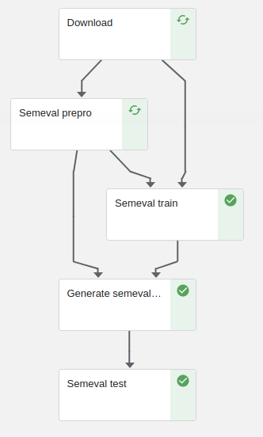

# Question Answering through Transfer Learning

In this repository, we adapt the code provided by the github [Question Answering through Transfer Learning](https://github.com/shmsw25/qa-transfer) project.
Our aim is to convert this code into a kubeflow pipeline.

# Pipeline parameters
| Pipeline parameter | Description |
| ------ | ------ |
|squad_url| Url from the squad model to be used in zip format (e.g 'http://github.com/sciling/qatransfer/releases/download/v0.1/save.zip')|
|squad_load_path|' Path of the loaded model in squad_url's files (e.g '/save/out/squad/basic/00/save/basic-2000')|
|squad_shared_path|' Path of the shared.json in squad_url's files (e.g '/save/out/squad/basic/00/shared.json')|
|train_run_id| id of the run (e.g '00')|
|train_sent_size_th| String representing the maximum length (# of words) of each sentence (e.g '150')|
|train_ques_size_th| String representing the maximum number of words composing the question (e.g '100')|
|train_num_epochs| Number of epochs to train the model (e.g '12')|
|train_num_steps| Number of steps to train the model (e.g '55')|
|train_eval_period| Period to perform evaluation on train (e.g '50')|
|train_save_period| Period to perform save on train (e.g '10')|
|test_start_step| Integer representing the step to start. Depends on the selected model (e.g if we use basic-2000 in load_path, starting step will be 2001)| 
|test_end_step| Integer representing the step to end. Must be strictly higher than test_start_step (e.g 2002)|
|test_eval_period| Period to perform evaluation on test (e.g '10')|
|test_threshold| Float representing test threshold (e.g 0.5)|
|test_th|  Integer for computing Precision up to a given threshold (e.g 10)|
|test_reranking_th| If maximum prediction score for a set of candidates is below this threshold, do not re-rank the candiate list. (e.g 10)|
|test_format| Format of the result file (e.g 'trec' or 'answerbag')|
|test_verbose| Produce verbose output (e.g False)|
|test_ignore_noanswer| Ignore questions with no correct answer (e.g False)|

# Pipeline stages #



##### 1. Download dataset ([code](./src/download.py))
This component downloads the pretrained squad model , glove and semeval dataset inside an OutputPath Artifact

##### 2. Preprocess ([code](./src/semeval_prepro.py))
This component preprocess the semeval dataset and save generated files inside an OutputPath Artifact.

##### 3. Train ([code](./src/semeval_train.py))
This component trains the semeval dataset taken into account both semeval preprocess generated files and squad model, and save generated model inside an OutputPath Artifact.

##### 4. Generate test files ([code](./src/generate_semeval_test_files.py))
This component generated some needed files for test inside an OutputPath Artifact taking into account the generated model.

##### 5. Test ([code](./src/semeval_test.py))
This component prints the MAP, MRR and AvgRecall of the generated model.

# File generation #
To generate the pipeline from the python file, execute the following command:

```python3 pipeline.py```

pipeline.py is located inside src folder. The pipeline will be created at the same directory that the command is executed.

Also, if you want to run all tests locally, execute:
```python3 -m unittest tests/*_test.py```

Once the pipeline has been created, we can upload the generated zip file in kubeflow UI and create runs of it.

# Experimental results #

In this section we will replicate the results for the semeval dataset in the [Question Answering through Transfer Learning from Large Fine-grained Supervision Data](https://github.com/sciling/qatransfer/blob/master/run.md).
The pipeline outputs different metrics from which can be directly compared.
In order to check the validity of the pipeline, we are going to execute a run. As we do not dispose of a capable machine nor a squad model pretrained with the same parameters as the one in the original experiment, the obtained results may be a bit worse than the original ones.

### Input parameters ###
| Pipeline parameter | Value |
| ------ | ------ |
|squad_url| 'http://github.com/sciling/qatransfer/releases/download/v0.1/save.zip' |
|squad_load_path| '/save/out/squad/basic/00/save/basic-2000' |
|squad_shared_path| '/save/out/squad/basic/00/shared.json' |
|train_run_id| '00' |
|train_sent_size_th| '10'|
|train_ques_size_th| '10'|
|train_num_epochs| '1'|
|train_num_steps| '1'|
|train_eval_period| '1'|
|train_save_period| '1'|
|test_start_step| 2001 | 
|test_end_step| 2002|
|test_eval_period| '1'|
|test_threshold| 0.5 |
|test_th|  10|
|test_reranking_th| 10|
|test_format| 'trec'|
|test_verbose| False |
|test_ignore_noanswer| False|

### Metrics ###
Using a pretrained squad model with one epoch and executing the pipeline with the previously defined parameters, we obtain the following results:


The original results are shown in . In particular, the results are:

| MAP | MRR | P@1
| ------ | ------ | ------ |
| 78.37 | 85.58	 | 87.68 |

In our replication, we get way worse results as expected because of the machine and the squad mdoel:

| MAP | MRR | AvgRec
| ------ | ------ | ------ |
| 59.53 | 67.83 | 72.60 |
