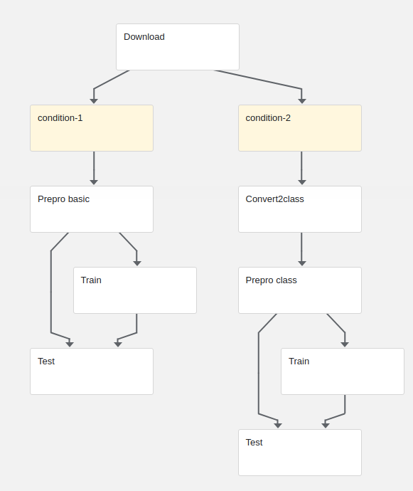

# Squad Modeling for Question Answering

The aim of this pipeline is to train an expert model of question answering with the squad dataset.

# Pipeline parameters
| Pipeline parameter | Description |
| ------ | ------ |
|prepro_train_ratio| Float representing the ratio of the data to be used to train  (e.g 0.7)|
|prepro_glove_vec_size| Integer representing the glove vec size to be used(e.g 100)|
|prepro_mode| String representing the preprocess mode ("full", "all" or "single")|
|prepro_tokenizer| String representing the preprocess tokenizer ("PTB" or "Stanford")|
|prepro_url| String representing the url of the server (e.g "vision-server2.corp.ai2")|
|prepro_port| Integer represeting the port of the server (e.g 8000)|
|train_sent_size_th| String representing the maximum length (# of words) of each sentence (e.g '150')|
|train_ques_size_th| String representing the maximum number of words composing the question (e.g '100')|
|train_num_epochs| Number of epochs to train the model (e.g '12')|
|train_num_steps| Number of steps to train the model (e.g '55')|
|train_eval_period| Period to perform evaluation on train (e.g '50')|
|train_save_period| Period to perform save on train (e.g '10').|

# Pipeline stages #



##### 1. Download dataset ([code](./src/squad/download.py))
This component downloads the squad and glove dataset inside an OutputPath Artifact

##### 2. Preprocess ([code](./src/squad/prepro.py))
This component preprocess the squad dataset and save generated files inside an OutputPath Artifact.

##### 3. Train ([code](./src/squad/train.py))
This component trains the squad dataset taken into account squad preprocess generated files and save generated model inside an OutputPath Artifact.

##### 4. Test ([code](./src/squad/test.py))
This component generated tested the model and saved some metrics in an OutputPath Artifact.

##### 5. Test ([code](./src/squad/generate_metrics.py))
This component creates a metric that the kubeflow UI can understand in order to visualize the accuracy and f1-score of the trained model.

# File generation #
To generate the pipeline from the python file, execute the following command:

```python3 pipeline.py```

pipeline.py is located inside src folder. The pipeline will be created at the same directory that the command is executed.

Also, if you want to run all tests locally, execute:
```python3 -m unittest tests/*_test.py```

Once the pipeline has been created, we can upload the generated zip file in kubeflow UI and create runs of it.

Once the model has been created, you can download it inside the minio server. In the semeval pipeline, you need a link that downloads the squad model as a zip. To obtain that, you could simply upload the zipped model inside some Github release and find out the link of the download. In order to find out the link of the download, you just need to check the requested url in the request made when you manually click on download the model.

# Experimental results #

In this section we will replicate the results for the squad dataset in the [Question Answering through Transfer Learning from Large Fine-grained Supervision Data](https://github.com/sciling/qatransfer/blob/master/run.md).
The pipeline outputs different metrics from which can be directly compared.
In order to check the validity of the pipeline, we are going to execute a run. As we do not dispose of a capable machine, the obtained results may be a bit worse than the original ones.

### Input parameters ###
| Pipeline parameter | Value |
| ------ | ------ |
|prepro_train_ratio|0.005|
|prepro_glove_vec_size|100|
|prepro_mode|"full"|
|prepro_tokenizer|"PTB"|
|prepro_url|"vision-server2.corp.ai2"|
|prepro_port|8000|
|train_sent_size_th|10|
|train_ques_size_th|10|
|train_num_epochs|1|
|train_num_steps|1|
|train_eval_period|1|
|train_save_period|1|

### Metrics ###
Using the predefined parameters, we obtain the following results:

| Accuracy | f1-score |
| ------ | ------ |
| 0.008	 | 0.030 |

The original results are shown in . In particular, the results are:

| Accuracy | f1-score |
| ------ | ------ |
| 82.86 | ?? |

In our replication, we get way worse results as expected because of the machine and the poor parameters.


