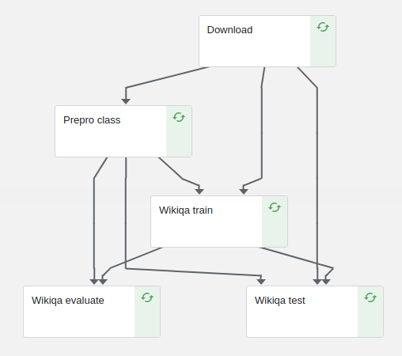

# WikiQA Modeling for Question Answering through Transfer Learning

The aim of this pipeline is to train a model of question answering with the wikiqa dataset with a technique called Transfer Learning. This technique will use the squad model previously trained in order to get better semeval model results.

# Pipeline parameters
| Pipeline parameter | Description |
| ------ | ------ |
|squad_url| Url from the squad model to be used in zip format (e.g '"https://github.com/sciling/qatransfer/releases/download/v0.1/save_class.zip")|
|squad_load_path|' Path of the loaded model in squad_url's files (e.g "/save/out/squad/basic-class/00/save/basic-class-1")|
|squad_shared_path|' Path of the shared.json in squad_url's files (e.g "/save/out/squad/basic-class/00/shared.json")|
|run_id| id of the run (e.g '00')|
|sent_size_th| String representing the maximum length (# of words) of each sentence (e.g '150')|
|ques_size_th| String representing the maximum number of words composing the question (e.g '100')|
|num_epochs| Number of epochs to train the model (e.g '12')|
|num_steps| Number of steps to train the model (e.g '55')|
|eval_period| Period to perform evaluation on train (e.g '5000').|
|save_period| Period to perform save on train (e.g '10').|
|start_step| Integer representing the step to start. Depends on the selected model (e.g if we use basic-class-1 in load_path, starting step will be 2)|
|end_step| Integer representing the step to end (e.g 2).|
|device| String representing the default device for summing gradients. ("/cpu:0")|
|device_type| String representing the device for computing gradients (parallelization) ("cpu" or "gpu" )|
|num_gpus| Integer representing the number of gpus or cpus for computing gradients (1)|

# Pipeline stages #



##### 1. Download ([code](./src/wikiqa/download.py))
This component downloads the pretrained squad class model , glove and wikiqa dataset inside an OutputPath Artifact

##### 2. Preprocess class ([code](./src/wikiqa/wikiqa_prepro.py))
This component preprocess the wikiqa dataset and save generated files inside an OutputPath Artifact.

##### 3. Wikiqa train ([code](./src/wikiqa/wikiqa_train.py))
This component trains the wikiqa dataset taking into account both wikiqa class preprocess generated files and squad model, and save the generated model inside an OutputPath Artifact.

##### 4. Wikiqa test ([code](./src/wikiqa/wikiqa_test.py))
This component prints the accuracy and loss of the generated model.

##### 5. Wikiqa evaluate ([code](./src/wikiqa/wikiqa_evaluate.py))
This component prints the MAP, MRR and P1 of the generated model.

# File generation #
To generate the pipeline from the python file, execute the following command:

```python3 pipeline.py```

pipeline.py is located inside src folder. The pipeline will be created at the same directory that the command is executed.

Also, if you want to run all tests locally, execute:
```./run_wikiqa_tests.sh  ```

Once the pipeline has been created, we can upload the generated zip file in kubeflow UI and create runs of it.


# Experimental results #

In this section we will replicate the results for the semeval dataset in the [Question Answering through Transfer Learning from Large Fine-grained Supervision Data](https://github.com/sciling/qatransfer/blob/master/run.md).
The pipeline outputs different metrics from which can be directly compared.
In order to check the validity of the pipeline, we are going to execute a run. As we do not dispose of a capable machine nor a squad model pretrained with the same parameters as the one in the original experiment, the obtained results may be a bit worse than the original ones.

### Input parameters ###
| Pipeline parameter | Value |
| ------ | ------ |
|squad_url| 'https://github.com/sciling/qatransfer/releases/download/v0.1/save_class.zip' |
|squad_load_path| '/save/out/squad/basic-class/00/save/basic-class-1' |
|squad_shared_path| '/save/out/squad/basic-class/00/shared.json' |
|run_id| '00' |
|sent_size_th| '10'|
|ques_size_th| '10'|
|num_epochs| '1'|
|num_steps| '1'|
|eval_period| '1'|
|save_period| '1'|
|start_step| 2 |
|end_step| 2|
|device| "/cpu:0"|
|device_type| "gpu"|
|num_gpus| 1 |


### Metrics ###
Using a pretrained squad model with one epoch and executing the pipeline with the previously defined parameters, we obtain the following results:


The original results are shown in . In particular, the results are:

| MAP | MRR | P@1
| ------ | ------ | ------ |
| 78.37 | 85.58	 | 87.68 |

In our replication, we get way worse results as expected because of the machine and the squad mdoel:

| MAP | MRR | P@1
| ------ | ------ | ------ |
| 40.031 | 40.586 | 20.339 |
